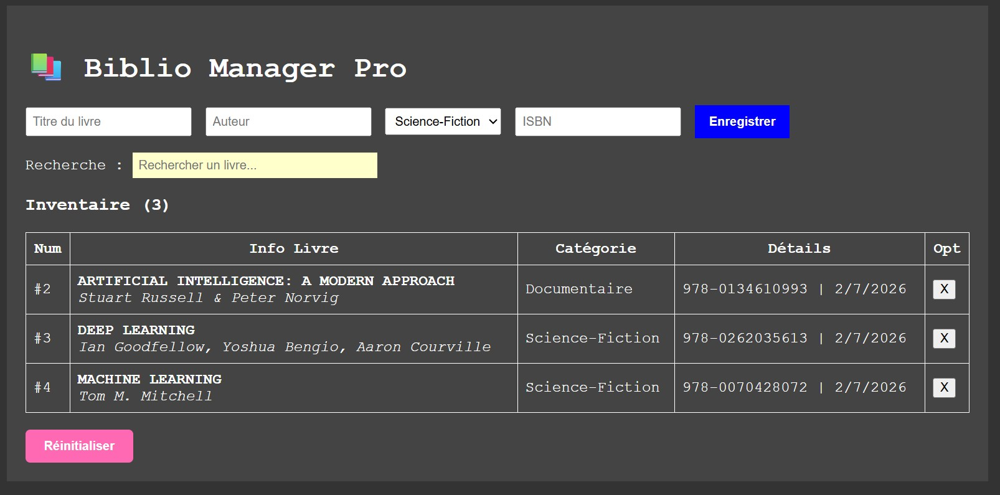
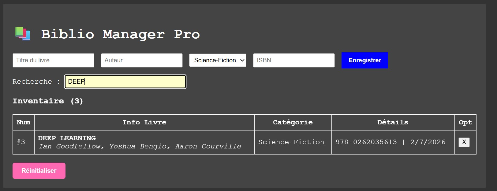

# 📚 Biblio Manager Pro

## Contexte
Biblio Manager Pro est une application web de **gestion de bibliothèque** permettant
d’organiser une collection de livres de manière simple et efficace.  
Ce projet a été réalisé et amélioré dans le cadre d’une évaluation académique visant à
mettre en place un **espace collaboratif professionnel** en utilisant GitHub, en reproduisant
un flux de travail réel en équipe.

## Objectifs
- Concevoir une application web simple de gestion de bibliothèque
- Permettre l’ajout, l’affichage, la recherche et la suppression de livres
- Organiser les informations des livres (titre, auteur, catégorie, ISBN)
- Assurer la persistance des données à l’aide du **localStorage**
- Proposer une interface claire, lisible et facile à utiliser
- Mettre en pratique le travail collaboratif avec GitHub (issues, branches, pull requests)

## Méthodologie
- **HTML** : structure de l’interface utilisateur (formulaire, recherche, tableau)
- **CSS** : mise en page et styles pour améliorer l’expérience utilisateur
- **JavaScript** : logique applicative (ajout, affichage, suppression, recherche, persistance des données)
- **GitHub** :
  - Utilisation des *Issues* pour le suivi et la répartition des tâches
  - Utilisation des *Branches* pour le travail en parallèle
  - Utilisation des *Pull Requests* pour la revue et la validation du code

## Fonctionnalités
L’application permet :
- Ajouter un livre (titre, auteur, catégorie, ISBN)
- Afficher les livres dans un tableau
- Supprimer un livre de la bibliothèque
- Rechercher un livre via un champ de recherche
- Sauvegarder les données localement grâce au **localStorage**

## Visualisations
Voici quelques captures de l’application :

  

## Architecture du projet
  biblio-manager-pro
│── index.html
│── README.md
│
├── css
│ └── style.css
│
├── js
│ └── app.js
│
└── assets
├── accueil.jpg
└── recherche.jpg

## Répartition du travail
- **Asmaa** : HTML, CSS, documentation, captures d’écran, revue des Pull Requests
- **Collègue** : JavaScript, logique applicative, revue des Pull Requests

## Comment exécuter le projet
1. Cloner le dépôt GitHub
2. Ouvrir le fichier `index.html` dans un navigateur web
